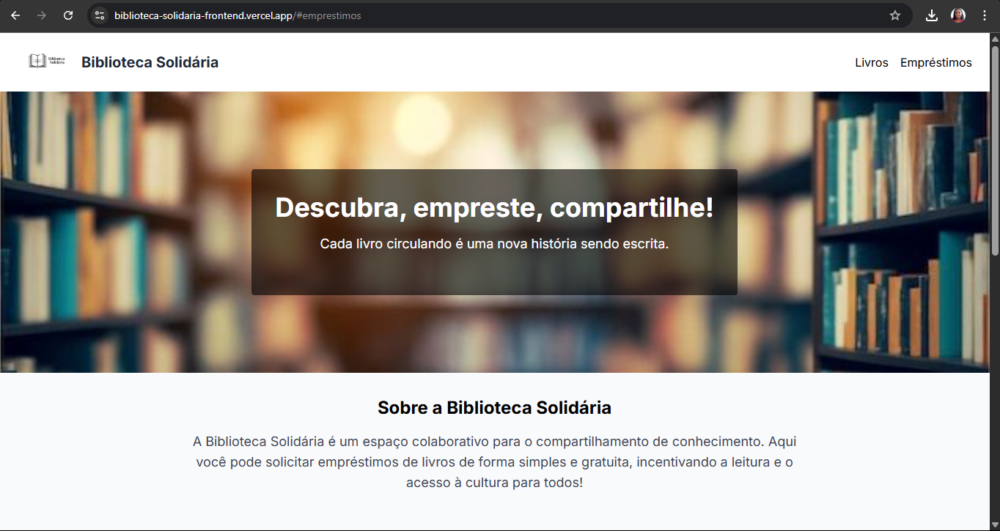

# 📚 Biblioteca Solidária

Aplicação web para visualização e empréstimo de livros, promovendo o compartilhamento gratuito de conhecimento entre pessoas. Desenvolvida como parte do mini projeto do Módulo 5 do curso **Programadores do Amanhã**.

🔗 **Deploy:** [biblioteca-solidaria-frontend.vercel.app](https://biblioteca-solidaria-frontend.vercel.app/)

---

## 🚀 Funcionalidades

- 📖 Visualização de livros disponíveis
- 🖼️ Capas dos livros com fallback de imagem
- 📝 Formulário para solicitação de empréstimos
- 📱 Layout responsivo e acessível
- 🎨 Estilo moderno com Tailwind CSS

---

## 💻 Tecnologias utilizadas

- **[Next.js](https://nextjs.org/)**  
- **[React](https://reactjs.org/)**  
- **[TypeScript](https://www.typescriptlang.org/)**  
- **[Tailwind CSS](https://tailwindcss.com/)**  
- **[Axios](https://axios-http.com/)**  
- **[Node.js + Express (backend)](https://expressjs.com/)**

---

## 📦 Estrutura do Projeto

```bash
biblioteca-solidaria-frontend/
├── public/
│   └── images/
│       └── capas/
│       └── imagem-biblioteca-solidaria.png
├── src/
│   ├── components/
│   │   ├── Header.tsx
│   │   ├── Hero.tsx
│   │   ├── LivrosSection.tsx
│   │   ├── EmprestimosSection.tsx
│   │   └── Footer.tsx
│   ├── services/
│   │   └── api.ts
│   ├── styles/
│   │   └── globals.css
│   └── types/
│       └── livros.ts
├── pages/
│   └── index.tsx
├── tailwind.config.js
└── tsconfig.json

## Como executar o projeto

# Clone o repositório
git clone https://github.com/seu-usuario/biblioteca-solidaria-frontend.git

# Acesse o diretório
cd biblioteca-solidaria-frontend

# Instale as dependências
npm install

# Rode o projeto
npm run dev

Certifique-se de que a API Backend esteja rodando em http://localhost:3000.

## 📸 Imagem da aplicação



## 📌 Melhorias futuras

🔎 Filtro de livros por gênero e autor

📤 Formulário para doação de livros

👩‍💼 Tela administrativa para aprovar/gerenciar empréstimos

💾 Persistência dos dados em banco de dados real (PostgreSQL)

## 👩‍💻 Desenvolvedora

Feito por Helen Gonçalves
Aluna no projeto Programadores do Amanhã

